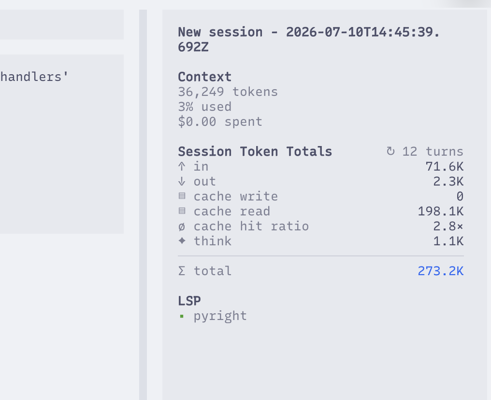

# OpenCode Session Token Summary

An OpenCode TUI plugin that adds a compact session-usage panel to the sidebar.
It aggregates the root session and all nested subagent sessions.



## Features

- Input, output, reasoning, cache read, and cache write tokens
- Assistant turn count across the root session and all descendants
- Aggregate API cost when OpenCode reports a nonzero cost
- Nested subagent discovery with bounded concurrent requests
- Race-safe refreshes that retain the last complete snapshot on API failure

## Requirements

- OpenCode `>=1.17.9`

## Install

Install this plugin through OpenCode's plugin installation flow:

1. Press `Ctrl+P` in OpenCode and choose **Install plugin**.
2. Press `Tab` to install globally.
3. Enter `opencode-plugin-session-token-summary` without a version or
   `@latest` suffix.

The installation creates an entry referencing this package in
`~/.config/opencode/tui.json`.

This plugin is functional only in version `0.3.0` and later.

### Updating

OpenCode does not currently support plugin updates reliably. See OpenCode PRs
[#35777](https://github.com/anomalyco/opencode/pull/35777),
[#32822](https://github.com/anomalyco/opencode/pull/32822), and
[#37300](https://github.com/anomalyco/opencode/pull/37300). To force OpenCode
to download current plugin versions, clear its plugin cache:

```sh
rm -rf ~/.cache/opencode
```

## Notes

The panel obtains descendant aggregates from OpenCode's session API and fetches
descendant messages to count their assistant turns. Requests are limited to four
concurrent operations. A failed refresh leaves the last complete sidebar values
in place rather than showing partial totals.

Cost is OpenCode's reported estimated API cost. Providers authenticated through
an included subscription, such as ChatGPT Pro/Plus OAuth, can report zero cost;
the cost row is intentionally hidden in that case.

## Development

```sh
npm install
npm run check
npm run pack:check
```

## License

[MIT](LICENSE)
